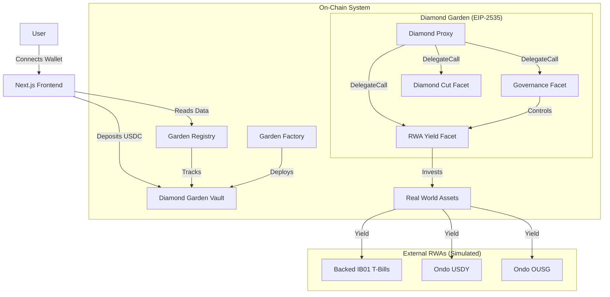

#  Diamond RWA Yield Engine

> **Institutional-grade yields, made simple.**


## 🌟 The Big Idea

**The Problem:**
DeFi yields are volatile and often unsustainable. On the other hand, **Real World Assets (RWAs)**—like US Treasury Bills—offer stable, risk-free returns (approx. 5-8%), but accessing them on-chain is complex, fragmented, and requires KYC for every single provider.

**The Solution:**
The **Diamond RWA Yield Engine** abstracts this complexity into "Gardens". Think of a Garden as a specialized vault where you plant your USDC, and it automatically routes your funds into institutional-grade RWA strategies.

We don't just give you one generic pool. We give you **choice** based on your risk profile.

---

## Core Features

### 1. Risk-Adjusted Strategies
Choose the Garden that fits your financial goals:
*   **Conservative Garden (Low Risk):** 100% backed by **US Treasury Bills (IB01)**. Maximum safety, stable yield (~5.2%).
*   **Balanced Garden (Medium Risk):** A diversified mix of T-Bills and **Ondo USDY** (Yield-bearing stablecoin). The perfect sweet spot.
*   **Aggressive Garden (High Risk):** Maximizes returns using **Ondo OUSG** (Short-term US Gov Bond Fund) and other high-yield instruments.

### 2. 💎 Built on EIP-2535 (Diamond Standard)
Most DeFi protocols are rigid. If a strategy stops working, you have to migrate liquidity.
**Our Gardens are Diamonds.** They are modular and upgradeable.
*   **Infinite Upgradeability:** We can swap out the "Yield Facet" (the strategy logic) without moving a single cent of TVL.
*   **No Migration Headaches:** Users deposit once and stay forever, even as strategies evolve.

### 3. 🗳️ DAO Governance
Each Garden is its own mini-DAO.
*   Token holders (depositors) receive voting power.
*   **Propose & Vote:** The community can vote to switch the underlying RWA provider (e.g., from Ondo to OpenEden) if a better rate appears.
*   **Timelock Security:** All upgrades have a 24-hour timelock to prevent malicious changes.

---

## 🏗️ System Architecture

The system uses a **Registry-Factory-Diamond** pattern to ensure scalability and security.



### Component Breakdown
1.  **Garden Registry**: The "Phonebook". It tracks all deployed Gardens and aggregates global stats (TVL, APY) for the dashboard.
2.  **Garden Factory**: The "Builder". It deploys new Gardens using standardized, secure "Blueprints" (Facets).
3.  **Diamond Garden**: The "Vault". The user-facing contract that holds funds and manages the strategy.

---

## 📜 Deployed Contracts (Sepolia Testnet)

The system is live on Sepolia. You can interact with these contracts using the frontend.

| Contract | Address |
|----------|---------|
| **Garden Registry** | [`0x00159f105A980a32EF197d1f42615A9B6AED2D14`](https://sepolia.etherscan.io/address/0x00159f105A980a32EF197d1f42615A9B6AED2D14) |
| **Garden Factory** | [`0xb0dB11129a30833d886A8DDA339Dc6F28097fBd9`](https://sepolia.etherscan.io/address/0xb0dB11129a30833d886A8DDA339Dc6F28097fBd9) |
| **Mock USDC** | [`0xff9F72cfc14647bEf7223964406145BA41e547d2`](https://sepolia.etherscan.io/address/0xff9F72cfc14647bEf7223964406145BA41e547d2) |

### Active Gardens

| Strategy | Address | Description |
|----------|---------|-------------|
| **Conservative** | [`0xcef8df49aCc225Bdf4062216ce413e217Df8E0cC`](https://sepolia.etherscan.io/address/0xcef8df49aCc225Bdf4062216ce413e217Df8E0cC) | **Backed IB01** (T-Bills) |
| **Balanced** | [`0xFE54f3ACC3AA176B3B06C6Ed14cf2bF8824A61c8`](https://sepolia.etherscan.io/address/0xFE54f3ACC3AA176B3B06C6Ed14cf2bF8824A61c8) | **Ondo USDY** (Mixed) |
| **Aggressive** | [`0x557467a18Acf3a9d8a23F87723325114943F57ab`](https://sepolia.etherscan.io/address/0x557467a18Acf3a9d8a23F87723325114943F57ab) | **Ondo OUSG** (High Yield) |

---

## 🛠️ Getting Started

### Prerequisites
- Node.js & npm
- Foundry (forge, cast, anvil)
- MetaMask (connected to Sepolia)

### Installation

1.  **Clone the repository:**
    ```bash
    git clone <repository-url>
    cd Blokathon
    ```

2.  **Install Dependencies:**
    ```bash
    cd frontend
    npm install
    cd ../Blokathon-Foundry
    forge install
    ```

3.  **Run Locally (Simulation):**
    ```bash
    # Terminal 1: Start local blockchain
    anvil

    # Terminal 2: Deploy contracts & Seed TVL
    cd Blokathon-Foundry
    forge script script/DeployMockGardenSystem.s.sol:DeployMockGardenSystem --rpc-url http://127.0.0.1:8545 --broadcast --private-key 0xac0974bec39a17e36ba4a6b4d238ff944bacb478cbed5efcae784d7bf4f2ff80
    ```

4.  **Start Frontend:**
    ```bash
    cd frontend
    npm run dev
    ```
    Open [http://localhost:3000](http://localhost:3000) to see the app.

---

## 🔮 Future Roadmap
- [ ] **Mainnet Integration**: Replace mock tokens with live Ondo/Backed contracts.
- [ ] **Cross-Chain Expansion**: Deploy Gardens on Base and Arbitrum.
- [ ] **Auto-Compounding**: Automatically reinvest yields into the strategy.
- [ ] **Privacy Layer**: Integrate Zero-Knowledge proofs for private deposits.
